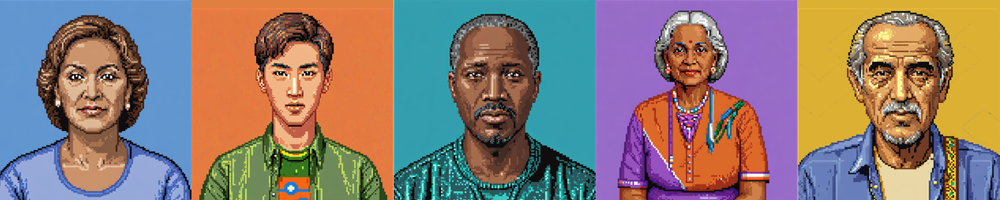

# synthetic-patients
cohort of synthetic patients for medical education

## available patients
- [jonathan green](https://chat.openai.com/g/g-sW6zB8ScQ-synthetic-patient-jonathan-green)
- [jessica torres](https://chat.openai.com/g/g-hTsJtDTqv-synthetic-patient-jessica-torres)
- [ahmed al farsi](https://chat.openai.com/g/g-YnPVTS8vU-synthetic-patient-ahmed-al-farsi)
- [sunita patel](https://chat.openai.com/g/g-WxcZeVGcq-synthetic-patient-sunita-patel)
- [jordan kim](https://chat.openai.com/g/g-9ijb6BUVB-synthetic-patient-jordan-kim)

## examples of chat histories
- https://chat.openai.com/share/4007554e-6739-4fc1-90f2-66bc688f1bb7
