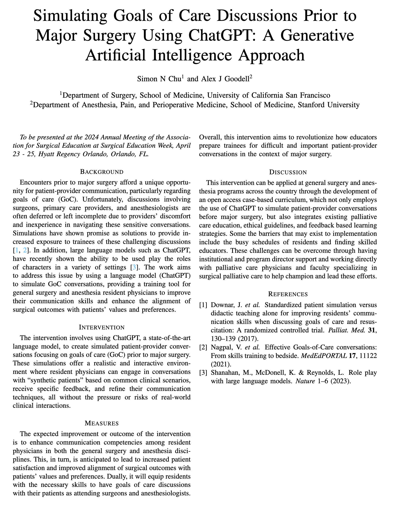

# Synthetic Patients for Medical Education
cohort of synthetic patients for medical education. please see directory **patient-profiles** for each of their prompts

## available patients
- [jonathan green](https://chat.openai.com/g/g-sW6zB8ScQ-synthetic-patient-jonathan-green)
- [jessica torres](https://chat.openai.com/g/g-hTsJtDTqv-synthetic-patient-jessica-torres)
- [ahmed al farsi](https://chat.openai.com/g/g-YnPVTS8vU-synthetic-patient-ahmed-al-farsi)
- [sunita patel](https://chat.openai.com/g/g-WxcZeVGcq-synthetic-patient-sunita-patel)
- [jordan kim](https://chat.openai.com/g/g-9ijb6BUVB-synthetic-patient-jordan-kim)

## examples of chat histories
- [Alex chatting with pancreatic cancer pt](https://chat.openai.com/share/4007554e-6739-4fc1-90f2-66bc688f1bb7)
- [Simon chatting with glioblastoma patient](https://chat.openai.com/share/7fa6e0fe-5e2e-4b6f-89cb-4a014afce991)

## example of video synthetic patient

https://github.com/alexgoodell/synthetic-patients/assets/2191507/0c5fb4de-0754-45f2-994e-a8cd0d2d9423

## pre-print

